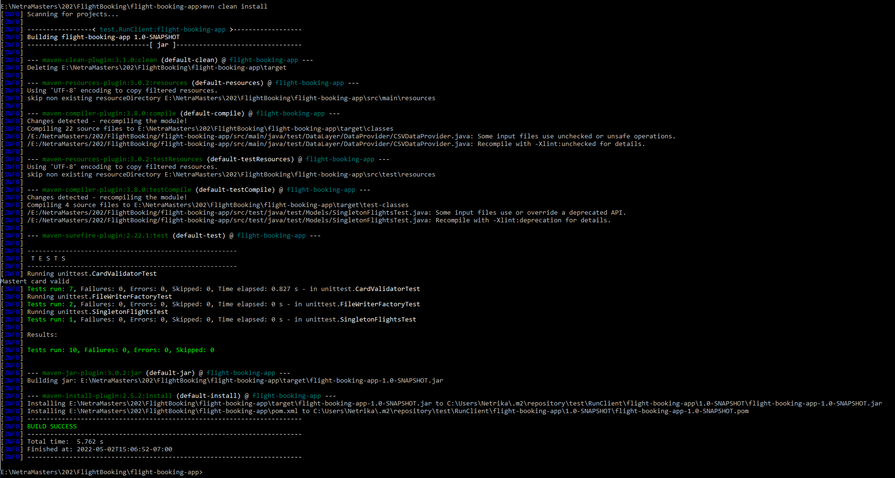
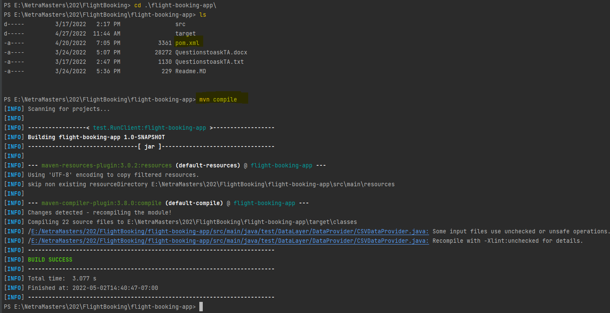

# individual-project-neetra
 Build a flight booking application 
 
# Project report is [here](Individual Project.docx) 
 
# Steps to build the project
- Navigate to your project directory
- Execute “mvn clean install”
	- Example:
		
 
- Execute common “mvn compile”
	- Example:
		
 
# Steps to run the project
- Powershell:
	```mvn exec:java "-Dexec.mainClass=test.RunClient" "-Dexec.args=`"path1 path2 path3 path4 `""```
- Cmd

	```mvn exec:java -Dexec.mainClass=test.RunClient -Dexec.args="path1 path2 path3 path4 "```
	
# Class Diagram	
-	

# Input Files for testing are [here](inputfiles)
	


